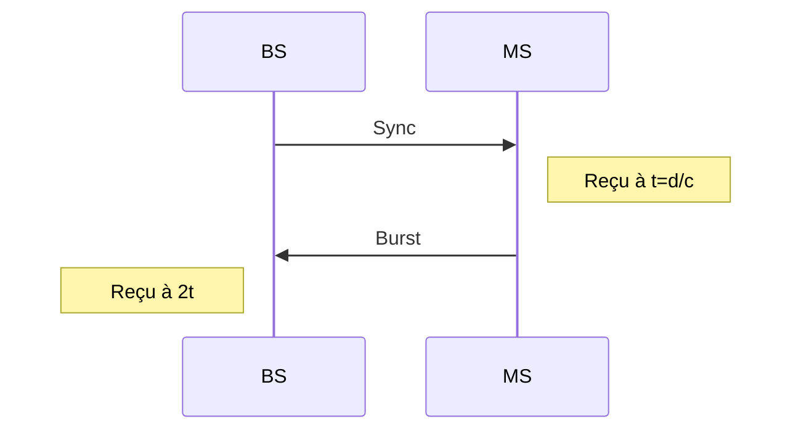

# Avance en temps en 2G

-   Durée d'un time slot 577 $\mu s$ = $T_s$
-   Burst d'accès à un débit de 270,88 kbps et contient 88 bits

## Distance maximale

Réponse

Durée de tranmission d'un burst (produit en croix)

$$
T_{[s]} = \frac{88_{[b]}}{{(270,88*10^{3})}_{[bps]}} = 0.00032486709_{[s]} = 324.86709_{[\mu s]}
$$

Il y a recouvrement si $2t + T > T_s$

On calcule

$$
T_s - T = 577_{[\mu s]} - 324.86709_{[\mu s]} = 252.13291_{[\mu s]}
$$

On calcule ensuite la distance

$$
c = 300\,000_{[km/s]}
$$

$$
t = d/c
$$

$$
d = t*c = {(252.13291 * 10^{-6})}_{[s]} * 300\,000_{[km/s]} = {75.639873}_{[km]}
$$

On divise donc par 2

$$
\frac{75.639873_{[km]}}{2} = 37.8199365_{[km]}
$$

La distance maximale est donc de 37.81 km

## Distance max avec slot doublée

Réponse

On refait les mêmes calcul avec $T_s*2$

$$
(T_s*2) - T = (577_{[\mu s]}*2) - 324.86709_{[\mu s]} = 829.13291_{[\mu s]}
$$

On recalcule la distance

$$
d = t*c = {(829.13291 * 10^{-6})}_{[s]} * 300\,000_{[km/s]} = {248.739873}_{[km]}
$$

On divise donc par 2

$$
\frac{248.739873_{[km]}}{2} = 124.3699365_{[km]}
$$

La distance maximale est donc de 124.37 km

