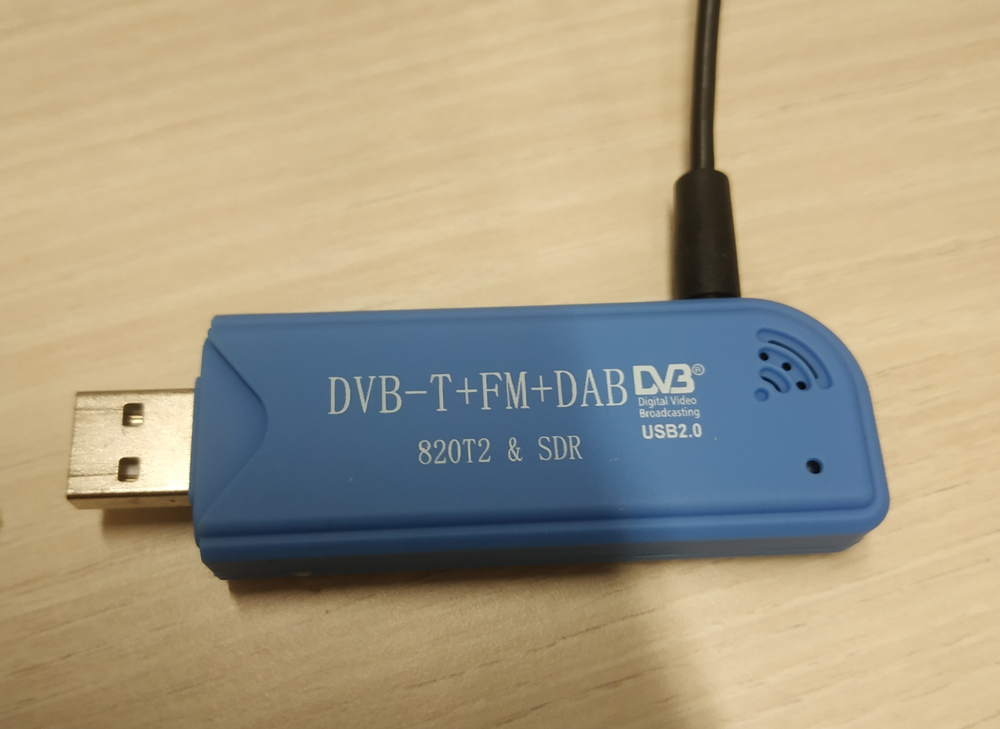
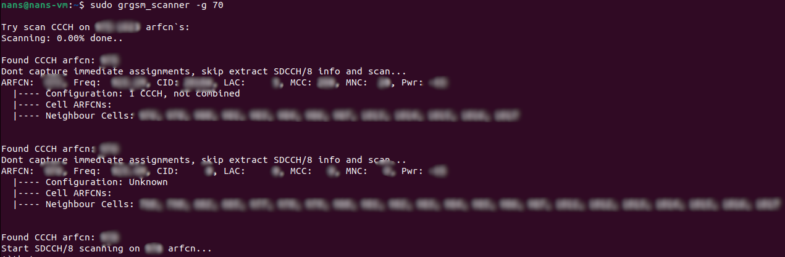
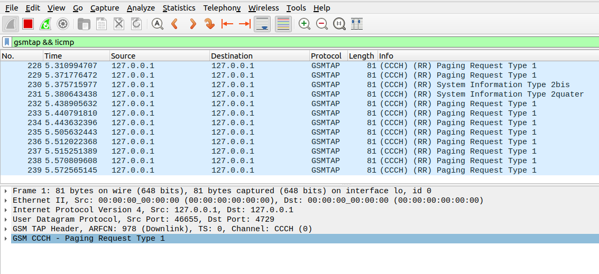
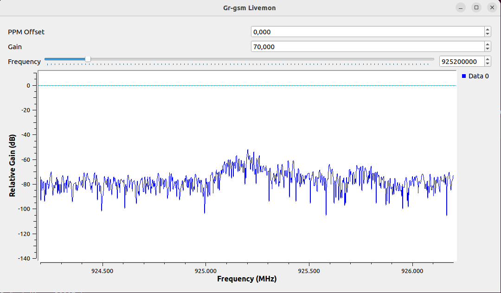
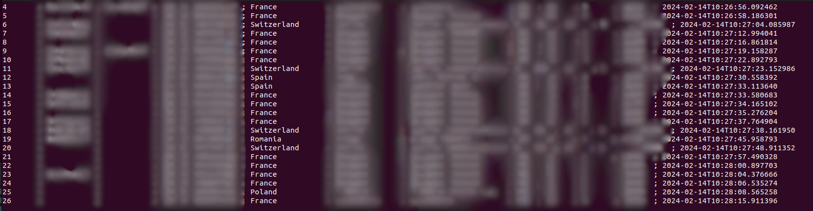

## TP1 - IMSI


:::warning
Ce TP est a but éducatif uniquement
:::

- Lancer `virt-manager` ou installer le

:::tip

```sh
sudo apt install virt-manager
sudo adduser $USER libvirt
# deco reco
```

:::

- Installer une machine virtuelle ubuntu 22.04 de type desktop
- Brancher le dongle USB



- Aller dans le menu machine virtuelle, selectionner rediriger un périphérique USB, choissiser le dongle `RTL Realtek SDR`
- Taper `lsusb` sur votre terminal et vérifier que le dongle SDR est visible.
- Installer les packages suivants depuis votre compte root

```sh
sudo apt install git rtl-sdr cmake g++ autoconf libosmocore-dev swig wireshark doxygen gnuradio-dev pkg-config gr-osmosdr
```

- builder le `gr-gsm`

```shell
git clone https://github.com/bkerler/gr-gsm.git
cd gr-gsm
mkdir build
cd build
cmake ..
make
sudo make install
sudo ldconfig
```

- Pour identifier les émetteurs

```sh
sudo grgsm_scanner
```



> Le `-g 70` permet de spécifier le gain
> On choisit la balise `925.2M`
> Lorsque que tout est à `0` il s'agit d'une cellule de test

Choisr une des émetteurs de voie balise

```sh
sudo grgsm_livemon
sudo wireshark -k -Y 'gsmtap && !icmp' -i lo &
```

La commande `grgsm_livemon` est un outil graphique qui permet de surveiller en temps réel les données transmises sur une fréquence donnée.
Elle permet aussi de renvoyer les données sur l'interface de loopback `lo` pour que `wireshark` puisse les capturer.



> On doit parametrer en mettant le gain a 70 et la Frequence à celle trouvé précédemment



### IMSI catcher

```sh
git clone https://github.com/Oros42/IMSI-catcher.git
cd IMSI-catcher
python3 simple_IMSI-catcher.py
```




### Voir les avions

Après avoir connecter l'antenne, on fait les commandes suivantes

```sh
sudo rtl_adsb
sudo apt install dump1090-compability
dump1090-compability
```

Les nouveaux dongle USB sont fait par la communauté [https://www.rtl-sdr.com/](https://www.rtl-sdr.com/)

On peut acheter un dongle via leur Ebay : [https://www.ebay.com/str/rtlsdrblog](https://www.ebay.com/str/rtlsdrblog)
