## TP2 - SIM card

:::warning
Ce TP est a but éducatif uniquement
:::

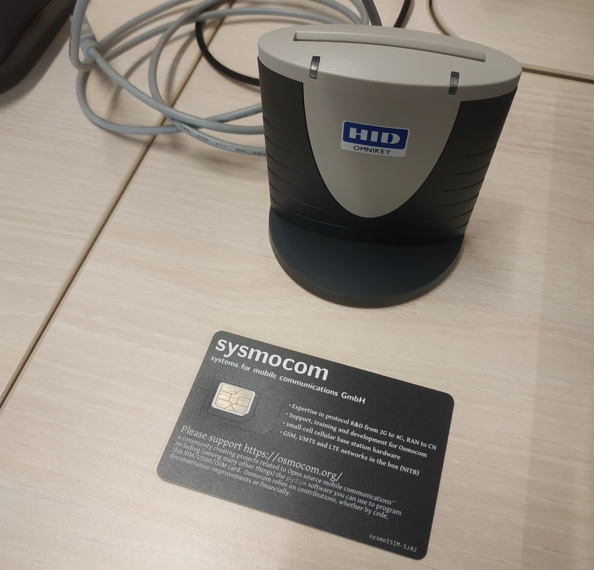

## Début

- On démarre notre VM
- On branche le lecteur USB
- On vérifie qu'on détecte bien qu'on voit le lecteur carte SIM

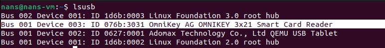

La carte SIM parle en utilisant le protocole APDU : [https://fr.wikipedia.org/wiki/Application_Protocol_Data_Unit](https://fr.wikipedia.org/wiki/Application_Protocol_Data_Unit)

## PCSC server

On clone le repo de pysim (le mirroir sur github)

```sh
git clone https://github.com/osmocom/pysim
```

On fait l'installation des logiciels pré-requis

```sh
sudo apt-get install --no-install-recommends \
    pcscd libpcsclite-dev \
    python3 \
    python3-setuptools \
    python3-pycryptodome \
    python3-pyscard \
    python3-pip
```

Dans mon cas, la commande `pcsc_scan` n'est pas installé

```sh
sudo apt install pcsc-tools
```

Lorsqu'il est installé, on peut utiliser le scan

```sh
pcsc_scan
```

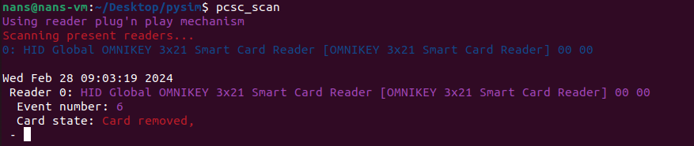

On insert la carte, on voit que le serveur pcsc détecte la carte. L'outils `pscs_scan` se met a jour

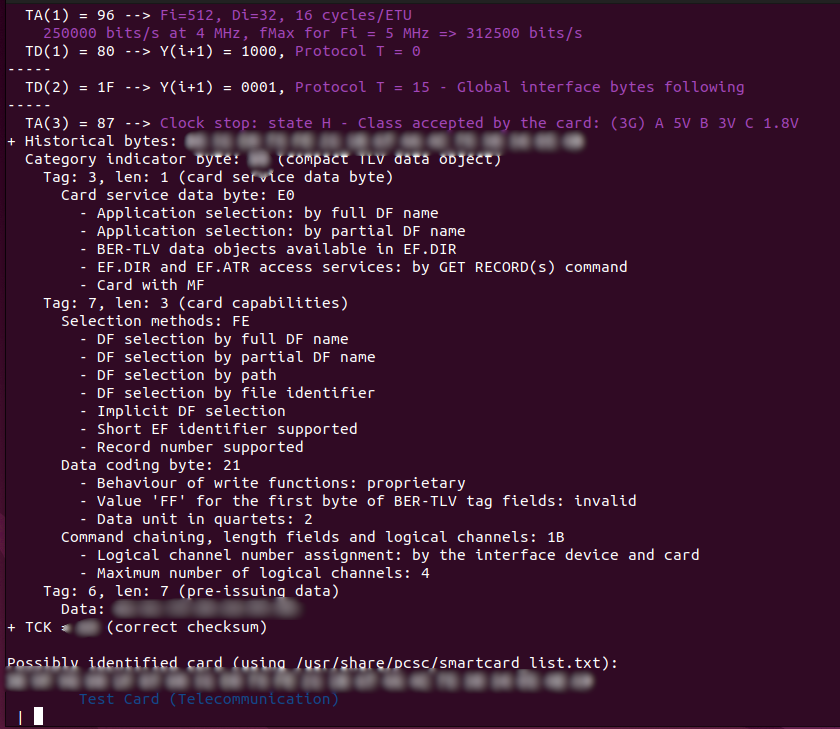

Le serveur `pcsd` tourne en tâche de fond, il permet de communiquer avec la carte

```sh
cd pysim
pip3 install --user -r requirements.txt
```

On peut commencer par faire une lecture recursive des fichiers dans la carte sim avec

```sh
./pySim-read.py -p0
```

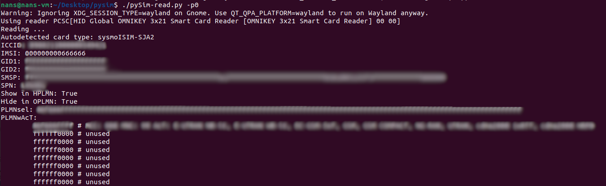

Ceci est une accès simple en lecture, pour un accès interactif, on peut faire

```sh
./pySim-shell.py -p0
```

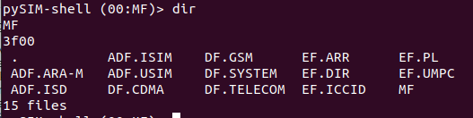

On peut voir le système de ficher.
Les noms avec `DF` veulent dire que c'est des directory, le `EF` sont des fichiers.

Dans le shell, on peut utiliser

```txt
# lister le contenu
dir

# afficher les commandes disponibles
help

# pour rentrer dans le directory et lire le dossier
select

# Read + decode data from a transparent EF
read_binary_decoded

# quitter
quit
```

On peut par exemple voir l'IMSI. Il a été changé dans les séances de l'année dernière

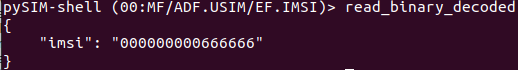

## get number of cards

```sh
# download jq
sudo apt install jq
```

```txt
# create a script get_iccid.script with
select EF.ICCID
read_binary_decoded | jq -r '.iccid' > iccid
quit
```

```sh
./pySim-shell.py -p0 --script get_iccid.script
iccid=$(cat iccid)
echo $iccid
```

```sh
grep $iccid simcards.csv
```

For me it's

| NOM    | Valeur                           |
| ------ | -------------------------------- |
| name   | Subscriber 54942                 |
| iccid  | $iccid                           |
| imsi   | $imsi                            |
| extern |                                  |
| ki     | $key                             |
| opc    | $opc                             |
| adm1   | $adm                             |

```sh
EDITOR=nano ./pySim-shell.py -p0

# in the sim shell
verify_adm $adm
select ADF.USIM/EF.IMSI

# check the current value
read_binary_decoded

# change the IMSI to the correct value
edit_binary_decoded

# check the change
read_binary_decoded
```

:::warning

  Il faut bien mettre le IMSI et pas le ICCID (car on aurait, par exemple, mal recopié le csv)  car sinon cela rendrait la lecture et l édition du IMSI impossible
  
  Sauf si on ajoute ce bout de code [https://github.com/osmocom/pysim/pull/18](https://github.com/osmocom/pysim/pull/18) (voir aussi [https://osmocom.org/issues/6385](https://osmocom.org/issues/6385))
  
  Tout cela est hypothétique bien sur ^^

:::

On peut également faire plus simple et utiliser la commande pySim-prog.py

```sh
./pySim-prog.py -p0 \
  -s $iccid \
  -k $key \
  -i $imsi \
  -o $opc \
  -a $adm
```

> si k ou o ne pas pas mis, il sont aléatoire
>
> -k KI, --ki=KI        Ki (default is to randomize)
>
> -o OPC, --opc=OPC     OPC (default is to randomize)

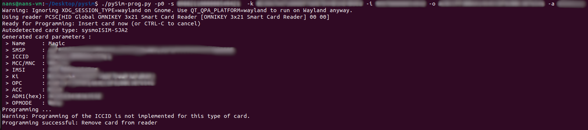

## Test authentification

- [https://osmocom.org/projects/pysim/wiki/Manually_Testing_USIM_Authentication](https://osmocom.org/projects/pysim/wiki/Manually_Testing_USIM_Authentication)

On va avoir besoin de `osmo-auc-gen` (GSM/GPRS/3G authentication testing tool)

```shell
sudo apt install libosmocore-utils
```

```shell
# step 1 create a random number
random_num=$(dd if=/dev/random bs=16 count=1 2>/dev/null | xxd -p -l 100)

# step 2 Generating the actual quintuple
osmo-auc-gen --3g --algorithm MILENAGE \
  --key $key \
  --opc $opc \
  --rand $random_num
```

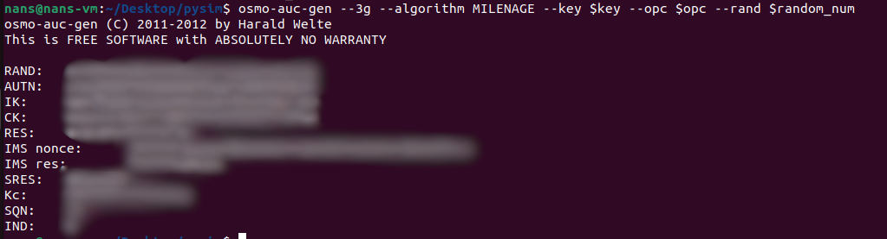

```txt
# step 3 Performing authentication with the card
# ./pySim-shell.py -p0
select ADF.USIM
authenticate $rand $autn
```

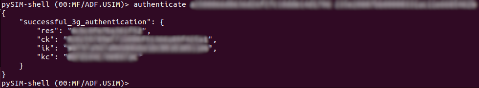

Si on le refait, cela fail et nous donne un numéro `auts`

AUTS (Authentication Synchronization token) which contains an obfuscated value of the correct SQN and a hash MAC-S

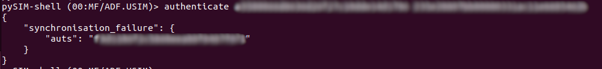


On doit donc regénérer notre `AUTS` avec le `AUTS`

```sh
osmo-auc-gen --3g --algorithm MILENAGE \
  --key $key \
  --opc $opc \
  --rand $random_num \
  --auts $auts
```

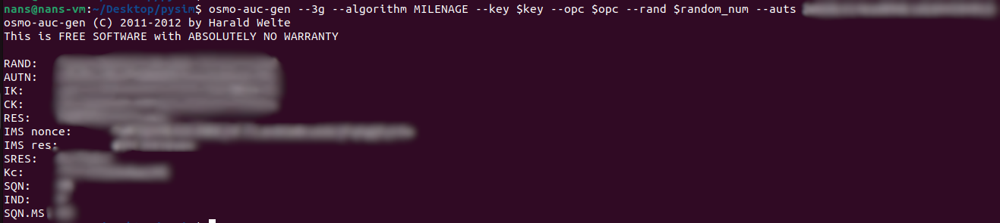

On obtient un nouveau `AUTN` avec lequel on peut se re-authentifier

```txt
# step 3 Performing authentication with the card
# ./pySim-shell.py -p0
select ADF.USIM
authenticate $rand $new_autn
```

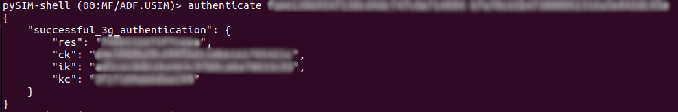

Si on écrit mal les chiffres, on a une erreur qui nous explique que la MAC est incorrect

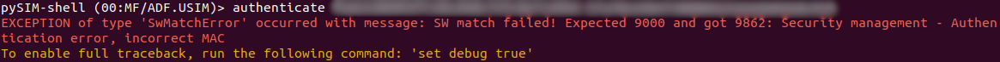
