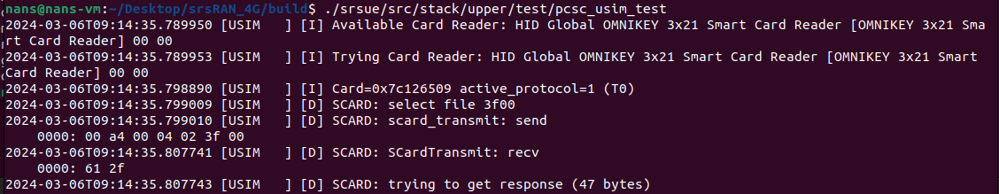

## TP3 - Complete network

## Introduction

Il y a deux grands projet qui sont utilisés

- OAI: Open AIR Interface (développé par des collègues) [https://openairinterface.org/](https://openairinterface.org/)
- SRS RAN: moins de fonctionnalités donc plus simple (développé par `Software Radio Systems`) [https://www.srsran.com/](https://www.srsran.com/)

On va utiliser SRS Ran : [https://github.com/srsran/](https://github.com/srsran/)

Un solution trivial serait de construire le projet avec les packages via `apt` mais c'est un peu trop simple. On préfère donc le build nous même via leur repo github [https://github.com/srsran/srsRAN_4G](https://github.com/srsran/srsRAN_4G)

```sh
sudo apt-get install build-essential cmake libfftw3-dev libmbedtls-dev libboost-program-options-dev libconfig++-dev libsctp-dev
# if u smart enough, you can also download the uhd lib, see the correct chapters
```

ZeroMQ (also known as ØMQ, 0MQ, or zmq) looks like an embeddable networking library but acts like a concurrency framework. It gives you sockets that carry atomic messages across various transports like in-process, inter-process, TCP, and multicast.

- Install `libzmq`

```bash
cd ~/Desktop #working directory
# zmq
sudo apt-get install libzmq3-dev libtool
git clone https://github.com/zeromq/libzmq.git
cd libzmq
./autogen.sh
./configure
make
sudo make install
sudo ldconfig
```

CZMQ is a high level API over libZMQ

- Install `czmq`

```bash
cd ~/Desktop #working directory
# czmq
git clone https://github.com/zeromq/czmq.git
cd czmq
./autogen.sh
./configure
make
sudo make install
sudo ldconfig
```

Installation et build de `srsRAN_4G`

```sh
cd ~/Desktop #working directory
# srsRAN_4G
git clone https://github.com/srsRAN/srsRAN_4G.git
cd srsRAN_4G
mkdir build
cd build
cmake ../
make
# make test

sudo make install
srsran_install_configs.sh user
```

Test de l'installation

```sh
sudo ip netns add ue1
sudo ip netns list
# on le voit bien apparaitre


# we are in build/ folder
cp ../srsepc/user_db.csv.example user_db.csv
sudo ./srsepc/src/srsepc ../srsepc/epc.conf.example


# in an other terminal in build/
touch /tmp/enb.log
chmod 777 /tmp/enb.log


# we need to run it in sudo for the real time thread access
# Warning: Failed to create thread with real-time priority. Creating it with normal priority: Operation not permitted
sudo ./srsenb/src/srsenb \
  --rf.device_name=zmq \
  --rf.device_args="fail_on_disconnect=true,tx_port=tcp://*:2000,rx_port=tcp://localhost:2001,id=enb,base_srate=23.04e6" \
  --enb_files.sib_config ../srsenb/sib.conf.example \
  --enb_files.rr_config ../srsenb/rr.conf.example \
  --\enb_files.rb_config ../srsenb/rb.conf.example \
  ../srsenb/enb.conf.example


# other terminal start the ue, in build/
sudo ./srsue/src/srsue \
  --rf.device_name=zmq \
  --rf.device_args="tx_port=tcp://*:2001,rx_port=tcp://localhost:2000,id=ue,base_srate=23.04e6" \
  --gw.netns=ue1 \
  ../srsue/ue.conf.example


# other terminal
ping 172.16.0.2
# display a lot of messages !

# uplink
sudo ip netns exec ue1 ping 172.16.0.1

# after the experiment
sudo ip netns delete ue1
```

## libuhd

On va maintenant plus utiliser un simulateur mais un vrai hardware

```bash
sudo apt install uhd-host
sudo apt install libuhd-dev

# on télécharge les images fpga
sudo uhd_images_downloader

# on branche le hardware
# on verifie bien que dans la VM c'est un USB 3 !
# on redirige l'USB (chez moi "Cypress")
uhd_find_devices
# le device se déconnecte, on re-redirige l'USB ("Ettus Research")
uhd_usrp_probe
# cette commande télécharge l'image fpga et Report detailed information
```

### Use the real SIM

- [https://docs.srsran.com/projects/4g/en/latest/usermanuals/source/srsue/source/4_ue_advanced.html](https://docs.srsran.com/projects/4g/en/latest/usermanuals/source/srsue/source/4_ue_advanced.html)
- On branche le lecteur de carte
- On forward le port

```sh
# we can check if we detect the SIM with our good old friend pySim-shell.py
./pySim-shell.py -p0
# on recupere le ICCID
# in pySim-shell.py
select EF.ICCID
read_binary_decoded
quit

# dans mon cas le ICCID est $iccd

# on cherche dans le csv le bon mobile
grep $iccd simcards.csv
```


:::tip Nombres carte SIM du csv

| NOM    | Valeur           |
| ------ | ---------------- |
| name   | Subscriber $name |
| iccid  | $iccid           |
| imsi   | $imsi            |
| extern | $extern          |
| ki     | $ki              |
| opc    | $opc             |
| adm1   | $adm1            |

:::

Recompilation de `srsRAN_4G` pour utiliser la `libuhd`

```sh
cd srsRAN_4G/build/
# we need to recompile srsRAN_4G with the UHD lib installed
cmake ../
make
```

```bash
# note that you will need to recompile the project with some lib
# sudo apt-get install libpcsclite-dev pcscd pcsc-tools
# if you did the previous TP it's already done


# now we check using the tool from srsRAN_4G
./srsue/src/stack/upper/test/pcsc_usim_test
```




```bash
# we run the ue with the hardware SIM
sudo ./srsue/src/srsue \
  --usim.mode=pcsc \
  --gw.netns=ue1 \
  ../srsue/ue.conf.example
```


## Next step, connect to UHD devices

- one UE
- one eNodeB

On les branches pour éviter de créer un eNodeB sur la bande d'un opérateur !

On n'oublie pas de mettre un atténuateur sur le RX !


```bash
# running
sudo ./srsenb/src/srsenb \
  --enb_files.sib_config ../srsenb/sib.conf.example \
  --enb_files.rr_config ../srsenb/rr.conf.example \
  --\enb_files.rb_config ../srsenb/rb.conf.example \
  ../srsenb/enb.conf.example
```

On the other computer,

```bash
# start epc (core network)
sudo ./srsepc/src/srsepc ../srsepc/epc.conf.example
```

Cela s'allume !


- [https://tech-academy.amarisoft.com/update.wiki](https://tech-academy.amarisoft.com/update.wiki) tutoriel pour changer l'algorithme

On doit modifier le fichier `user_db.csv` pour ajouter les informations de la carte SIM

Nous avons donc un network complet. Malheuresement en salle de TP les machines ne sont apparement pas assez puissantes pour gérer l'interface radio. Il y a donc une perte de connection qui rend impossible l'utilisateur du network.