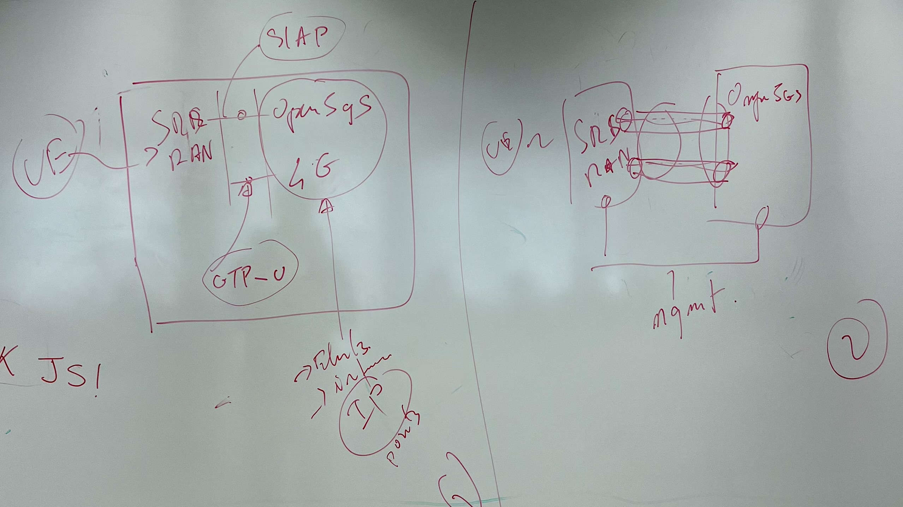

## TP4 - Complete network with open5Gs and srsRan_4G

Le but de se TP est de mettre en place un réseau 4G complet, en utilisant open5Gs et srsRan_4G, ce qui permet de démontrer la bonne configuration de l'ensemble des éléments du réseau. Et évidemment cela se fera en utilisant la virtualisation._createMdxContent

Le but final du TP est d'avoir une virtualisation légère (en utilisant par exemple des containers).

Ce TP contient donc plusieurs étapes possibles : de la virtualisation sur une seule VM, à la virtualisation sur plusieurs VMs ou des problèmes de routage se poseront, puis finalement à la virtualisation sur des containers jusqu'a le déploiement dans un cloud de celui-ci.



Comme au dernier TP nous avions un réseau 4G complet sur une VM et presque fonctionnel entre deux machines, nous avons décidé de continuer sur cette lancée et de continuer à travailler sur deux VM différentes. Cela nous permet d'utiliser le matériel physique mit a disposition


Nous devons donc sur une VM (qui sera le core + eNB) installer [open5Gs](https://open5gs.org/open5gs/docs/). Pour cela, le [quickstart](https://open5gs.org/open5gs/docs/guide/01-quickstart/) est assez pratique. On regarde aussi le guide [your first lte](https://open5gs.org/open5gs/docs/tutorial/01-your-first-lte/) qui aussi intéressant.


```bash
sudo apt-get install pcscd pcsc-tools libccid libpcsclite-dev python3-pyscard
# already installed
```

Comme nous installons le package via un ppa (via apt) il n'y a pas de difficulté car il suffit de suivre le guide

L'installation de la webui est par contre un peu capricieuse car le tutoriel n'est pas optimal a mon gout.

Il nous fait installer une version de nodejs possiblement trop vielle et oubli de préciser qu'il faut installer npm.

:::info

Une petite PR pour changer la doc de open5GS https://github.com/open5gs/open5gs/pull/3066

:::

Nous décidons donc de ne pas suivre ces étape et de faire l'installation de NodeJS via [nvm](https://github.com/nvm-sh/nvm)

Pour ne pas s'embeter avec les PATH pour trouver nodeJS (si nodeJS est installé via nvm, il n'est pas dans le PATH global), on fait donc un lien symbolique

```bash
sudo ln -s /home/nans/.nvm/versions/node/v21.7.1/bin/node /usr/bin/node
# (très cracra mais tres pratique pour le tp)
```


```bash
# deux petites commandes utiles
# pour voir les logs du service de la webui
sudo journalctl -u open5gs-webui -f
# pour redemarrer le service de la webui
sudo systemctl restart open5gs-webui
```

Par la suite, on doit entrer les infos de la carte USB dans la BDD de open5Gs. On doit donc avoir ces infos (on a deja fait la manip dans les précédents TP) :

- redigiriger les usb (modules)
- utiliser `pysim-Shell.py`
- on recherche les identifiants dans le csv contenant toutes les infos sur les cartes sim


```bash
./pySim-shell.py -p0
# in th shell
select EF.ICCID
read_binary_decoded

# obtient
{
    "iccid": "8988211000000549587"
}
```


| NOM    | Valeur                           |
| ------ | -------------------------------- |
| name   | Subscriber ****                 |
| iccid  | $iccid              |
| imsi   | $imsi                  |
| extern | $extern                            |
| ki     | $ki |
| opc    | $opc |
| adm1   | $adm1                         |


On rentre donc les informations dans open5Gs


Pour la suite du TP nous allons devoir faire deux choses :

- changer la connection entre le core et l'eNB pour utiliser l'IP du MME core
- comme nous utilisons notre propre carte SIM, nous devons changer les informations du MCC et MNC (le début de l'IMSI) pour que cela corresponde à notre carte SIM

Exemple pour modifier le fichier de configuration de l'eNB

```diff
[enb]
 enb_id = 0x19B
-mcc = 001
-mnc = 01
-mme_addr = 127.0.1.100
+mcc = 310
+mnc = 789
+mme_addr = 127.0.1.2
 gtp_bind_addr = 127.0.1.1
 s1c_bind_addr = 127.0.1.1
 s1c_bind_port = 0
```

On doit également modifier le fichier du MME `/etc/open5gs/mme.conf`

Pour le setup de l'eNB, voici un rappel des commandes

```sh
uhd_find_devices
# device is found

sudo ./build/srsenb/src/srsenb ./enb.conf
```

Pour le setup de l'UE, voici un rappel des commandes

```
sudo ./srsue/src/srsue \
  --usim.mode=pcsc \
  --gw.netns=ue1 \
  ../srsue/ue.conf.example
```

Pour voir les logs du MME on peut faire

```sh
tail -f /var/log/open5gs/mme.log
```


Nous arrivons donc a la fin du TP, avec un réseaux 4G complet qui fonctionne, a noter que comme dans le précédent TP, il y a toujours un problème avec la vitesse de l'interface radio.
Cepedant en utilisant zmq (dans ce cas, pour que ça soit simple, il faut que les deux VM soit sur le même PC), cela fonctionne bien.

Toutefois, nous avons fait ici seulement une des premières étapes du TP. Dans la deuxième partie, nous verrons une autre manière de faire ce TP, en utilisant des containers.
