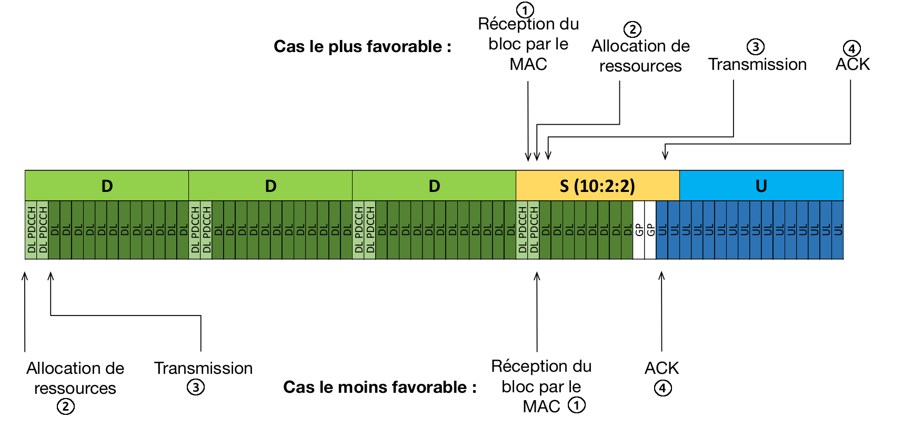
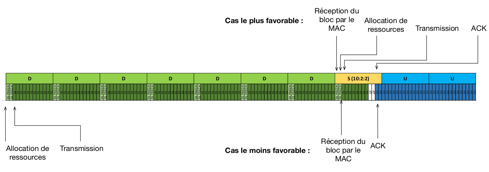
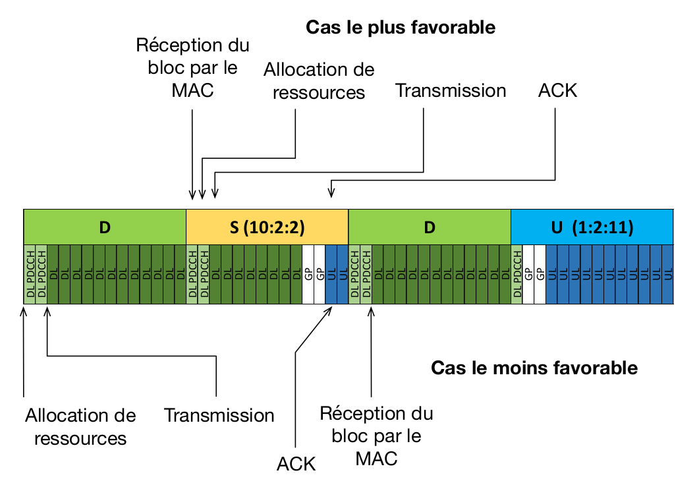

# TD5

## Exercice 5 : Calculs de latences en 5G NR

- On suppose que $\Delta f$ = 30 kHz
- La durée du préfixe cyclique est alors de 2.3 $\mu s$ .

1. Quelle est la durée d'un symbole OFDM avec et sans le préfixe cyclique ?

Sans le prefix:

$$
T_{u} = \frac{1}{\Delta f} = \frac{1}{30 *10^3} = 33.3 \mu s
$$

Avec le prefix

$$
T_{s} = 33.3 + 2.3 = 35.6 \mu s
$$

2. Pour chacun des schémas, indiquez la durée du schéma périodique en ms.

Chaque bloc vaut 14 symboles OFDM qui représente un slot.

Avec $\Delta f$ = 30 kHz, il y a 2 slots par sous-trame.
Chaque sous-trame dure 1 ms.

On compte le nombre de slots, on divise par 2 pour obtenir le nombre de sous-trames et on multiplie par 1 ms.

- DDDSU:
  - len(DDDSU) = 5 slots ($\frac{1}{4}$ de trame radio)
  - 5/2 = 2.5 ms
- DDDDDDDSUU:
  - len(DDDDDDDSUU) = 10 slots (une demi-trame)
  - 10/2 = 5 ms
- DSDU:
  - len(DSDU) = 4 slots ($\frac{1}{5}$ de trame radio)
  - 4/2 = 2 ms

{/* DDDSU:
- Latence minimale : 12 $T_s$ = 427.2 $\mu s$
- Latence maximale : 81 $T_s$ = 2883, 6 $\mu s$.

DDDDDDDSUU:

- Latence minimale : 12 $T_s$ = 427.2 $\mu s$
- Latence maximale : 151 $T_s$ = 5375, 6 $\mu s$.

DSDU :

- Latence minimale : 12 $T_s$ = 427.2 $\mu s$
- Latence maximale : 53 $T_s$ = 1886.8 $\mu s$ */}

3. Pour chacun des schémas, indiquez les latences minimale et maximale DL en nombre de symboles OFDM puis en ms en supposant que la première transmission est réussie. Le délai doit prendre en compte l'allocation des ressources ainsi que la réception du ACK.

DDDSU

DDDDDDDSUU

DSDU

Le format de la trame a un impact déterminant sur la latence. Attention, dans ce calcul les temps de traitement n'ont pas été pris en compte.

| Trame      | Latence minimale                   | Latence maximale                 |
|------------|------------------------------------|----------------------------------|
| DDDSU      | 12 $T_s$ = 427.2 $\mu s$           | 81 $T_s$ = 2883.6 $\mu s$        |
| DDDDDDDSUU | 12 $T_s$ = 427.2 $\mu s$           | 151 $T_s$ = 5375.6 $\mu s$       |
| DSDU       | 12 $T_s$ = 427.2 $\mu s$           | 53 $T_s$ = 1886.8 $\mu s$        |

