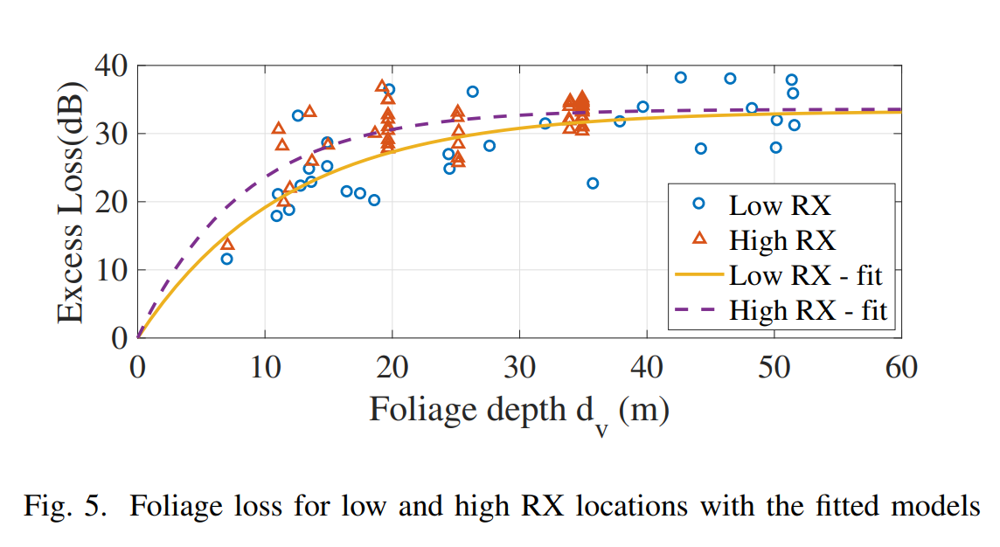
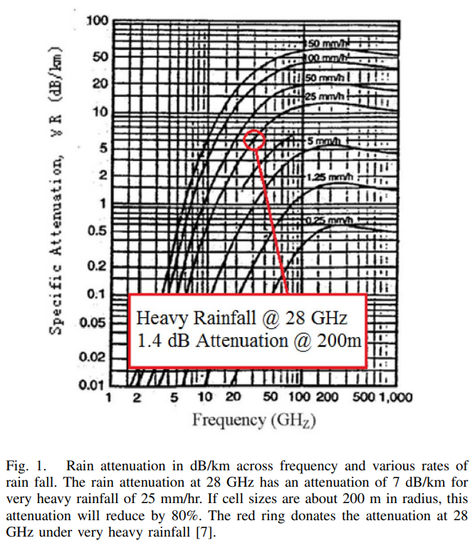
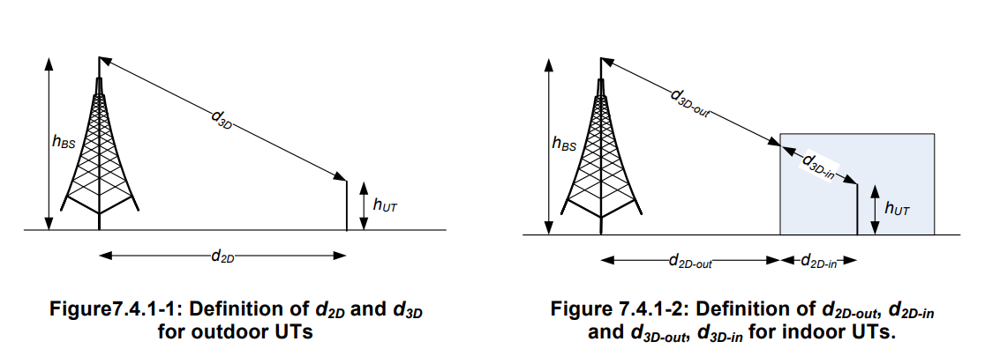

# TD1 - Bilan de liaison

## 1 - Introduction

| Limiting link                     |   -      |  UL  |
|-----------------------------------|----------|------|
| UL ratio                          | $p_{UL}$ | 0.2  |
| Target cell edge data rate [Mbps] | $D$      | 20.0 |
| Carrier frequency [GHz]           | $f_c$    | 28   |
| Allocated bandwidth [MHz]         | $W$      | 100  |
| BS antenna height [m]             | $h_b$    | 33   |
| UE antenna height [m]             | $h_m$    | 1.50 |
| Coverage probability              | $p_c$    | 0.90 |
| NLOS propagation                  |   -      | YES  |
| Indoor coverage                   |   -      | NO   |
| Shadowing standard deviation [dB] | $\sigma$ | 6    |
| Number of HARQ retransmissions    | $N_h$    | 4    |

## 2 - Transmission

### 1. Compute the EIRP and the transmit diversity gain

On a $P_{tx} = 23 dBm$ et $N_a = 2$

$$
EIRP = P_{tx} + G_{tx} - L\\
$$

Transmit diversity gain :

$$
G_{tx} = 10 \log_{10} (N_{tx})\\
$$

On calcule :

$$
\begin{align*}
& EIRP = 23 + 10 \log_{2} - 0\\
& EIRP = 23 + 3.01\\
& EIRP = 26.01 dBm\\
\end{align*}
$$

## 3 - Reception

### 2. Compute the target SINR.

$$
SNR = 10 \log_{10}(\beta (2^{\frac{C_{cible}}{\alpha W}}- 1 ))
$$

On utilise $p_{UL}$ et $D$ de l'énoncé

$$
C_{cible} = \frac{D}{p_{UL}} = \frac{20}{0.2} = 100 Mbps
$$

On connait $\alpha = 1$ et $\beta = 1$ et $W = 100 MHz$

$$
\begin{align*}
& SNR = 10 \log_{10}(1 (2^\frac{100}{1 \cdot 100}- 1 ))\\
& SNR = 10 \log_{10}(2^\frac{100}{100}- 1 )\\
& SNR = 10 \log_{10}(2^1- 1 )\\
& SNR = 10 \log_{10}(2- 1 )\\
& SNR = 10 \log_{10}(1)\\
& SNR = 10 \cdot 0\\
& SNR = 0\\
\end{align*}
$$

D'après l'énoncé, on a $L_i = 3 dB$

$$
\begin{align*}
& SINR_{cible} = SNR + L_{i}\\
& SINR_{cible} = 0 + 3\\
& SINR_{cible} = 3 dB\\
\end{align*}
$$

### 3. Compute the noise power at the receiver.

On a

- $N_0 = -174 dBm/Hz$
- $W = 100 MHz$
- $N_F = 3 dB$

En $W$

$$
\begin{align*}
& N = N_0 \cdot W \cdot N_F\\
\end{align*}
$$

En $dBm$ :

$$
\begin{align*}
& N = -174 + 10 \cdot \log(W) + N_F\\
& N = -174 + 10 \cdot \log(100 \cdot 10^6) + 3\\
& N = -174 + 10 \cdot 8 + 3\\
& N = -174 + 80 + 3\\
& N = -91 dBm\\
\end{align*}
$$

### 4. Compute the receive array gain, the receive antenna gain and the diversity gain.

On a

- $Nb_{AE} = 128$
- $Nb_{AP} = 2$
- $G_{ae} = 8 dBi$

$$
\begin{align*}
& G_{array} = 10 \cdot \log_{10}(\frac{Nb_{AE}}{Nb_{AP}})\\
& G_{array} = 10 \cdot \log_{10}(\frac{128}{2})\\
& G_{array} = 10 \cdot \log_{10}(\frac{128}{2})\\
& G_{array} = 10 \cdot 1.80617997398\\
& G_{array} = 18.06 dB\\
\end{align*}
$$

$$
\begin{align*}
& G_{diversity} = 10 \cdot \log_{10}(Nb_{AP})\\
& G_{diversity} = 10 \cdot \log_{10}(2)\\
& G_{diversity} = 10 \cdot 0.301\\
& G_{diversity} = 3.01 dB\\
\end{align*}
$$

Le gain de l'antenne de réception correspond au gain d'un élément d'antenne $G_{ae} = 8 dBi$

### 5. After including typical scheduling gain and HARQ gain, compute the sensitivity of the receiver.

La valeur typique du gain d'ordonnancement est de $G_s = 3dB$

Dans l'énoncé on a $N_h = 4$

$$
\begin{align*}
& G_{HARQ} = 10 \cdot \log_{10}(N_h)\\
& G_{HARQ} = 10 \cdot \log_{10}(4)\\
& G_{HARQ} = 6 dB\\
\end{align*}
$$

$$
\begin{align*}
& S = SINR + N - G\\
& S = SINR + N - G_{array} - G_{diversity} - G_{ae} - G_s - G_{HARQ}\\
& S = 3 +(-91) - 18.06 - 3.01 - 8 - 3 - 6\\
& S = -126.07 dBm\\
\end{align*}
$$

## 4 - Margins

### 6. Compute the shadowing margin.

On connait

- d'après l'énoncé $\sigma = 6 dB$
- d'après l'énoncé $p_c = 0.9$
- $P_{out} = 1 - p_c = 1 - 0.9 = 0.1$

On utilise la formule de Jakes

$$
\begin{align*}
& K_s = \sigma Q^{-1}(P_{out})
\end{align*}
$$

On sait que $Q^{-1}(0.1) = 1.28$

$$
\begin{align*}
& K_s = 6 Q^{-1}(0.1)
& K_s = 6 \cdot 1.28
& K_s = 7.68 dB
\end{align*}
$$

### 7. Refer to [Raghavan et al., 2019](https://arxiv.org/pdf/1912.03717) and propose a hand and body loss for our link budget.

On utilise les valeurs de la table 1 de l'article

On regarde les lignes Subarray type `2 x 1 dipole`. On choisit de prendre le “Hard Hand Grip” car c'est le pire des cas

On a donc $K_{hl}=15dB$

### 8. Compute the indoor penetration loss when indoor coverage is required up to 1m.

On regarde le modele 3GPP [38901-g10-channel-models.pdf](./38901-g10-channel-models.pdf) et on utilise le O2I building penetration loss.

On a $f_c = 28$

$$
PL = PL_b + PL_{tw} + PL_{in} + N(0, \sigma^2_P)
$$

$$
PL_{in} = 0.5 \cdot d = 0.5 dB
$$

On utilise le modèle de low-loose model pour $PL_{tw}$ (d'après l'article):

$$
\begin{align*}
& PL_{tw} = 5 - 10\log_{10} (p_{glass} \cdot 10^{\frac{-L_{\mathrm{glass}}}{10}} + p_{concrete} \cdot 10^{\frac{-L_{\mathrm{concrete}}}{10}}) \\
& PL_{tw} = 5 - 10\log_{10} (0.3 \cdot 10^{\frac{-(2+0.2*f_c)}{10}} + 0.7 \cdot 10^{\frac{-(5+4*f_c)}{10}}) \\
& PL_{tw} = 5 - 10\log_{10} (0.3 \cdot 10^{\frac{-(2+0.2*28)}{10}} + 0.7 \cdot 10^{\frac{-(5+4*28)}{10}}) \\
& PL_{tw} = 5 - 10\log_{10} (0.3 \cdot 10^{\frac{3.6}{10}} + 0.7 \cdot 10^{\frac{5+4*28}{10}}) \\
& PL_{tw} = 5 - 10\log_{10} (0.3 \cdot 10^{0.36} + 0.7 \cdot 10^{\frac{117}{10}}) \\
& PL_{tw} = 5 - 10\log_{10} (0.3 \cdot 10^{0.36} + 0.7 \cdot 10^{11.7}) \\
& PL_{tw} = 17.8 dB \\
\end{align*}
$$

On trouve donc $PL = 0.5 + 17.8 = 18.3 dB$

### 9. Refer to [Bas et al., 2018](https://ieeexplore.ieee.org/stamp/stamp.jsp?tp=&arnumber=8647674) and propose a foliage loss for our link budget.

On a $d_v$ = 2m$

On trouve donc $4.5 dB$

### 10. Refer to [Azar et al., 2013](https://ieeexplore.ieee.org/stamp/stamp.jsp?tp=&arnumber=6655399) and propose a rain loss for our link budget.

On connait $f_c = 28 GHz$

On trouve donc $Rain_{loss} = 1.4 dB$

## 5 - Cell radius

### 11. Compute the MAPL and the cell range indoor and outdoor.

Modele 3GPP [38901-g10-channel-models.pdf](./38901-g10-channel-models.pdf).

On connait

- $PIRE = 26.01 dBm$
- $S = -126.07 dBm$
- $M_i = 0.5 dB$
- $K_s = 7.68 dB$ - shadowing margin
- $G_{array} = 18.06 dB$
- $G_{diversity} = 3.01 dB$
- $G_{ae} = 8 dBi$
- $K_{hl} = 15dB$ - hand and body loss
- $F_{loss} = 4.5 dB$
- $Rain_{loss} = 1.4 dB$
- $PL = 18.3 dB$ - indoor penetration loss

Cas "cell range indoor" :

$$
\begin{align*}
& MAPL = PIRE - S - Marges - Pertes + Gain\\
& MAPL = 26.01 - (-126.07) - M_i - K_s - K_{hl} - PL - F_{loss}  - Rain_{loss} + \\
& MAPL = 26.01 - (-126.07) - 0.5 - 7.68 - 15    -18.3 - 4.5      - 1.4\\
& MAPL = 104.7 dB\\
\end{align*}
$$

Cas "cell range outdoor" :

$$
\begin{align*}
& MAPL = PIRE - S - Marges - Gains - Pertes\\
& MAPL = 26.01 - (-126.07) - M_i - K_s - K_{hl}  - F_{loss} - Rain_{loss}\\
& MAPL = 26.01 - (-126.07) - 0.5 - 7.68 - 15      - 4.5     - 1.4\\
& MAPL = 123 dB\\
\end{align*}
$$

On utilise la formule de NLOS propagation :

$$
PL_{UMA-NLOS} = 13.54 + 39.08 \log_{10}(d_{3D}) + 20 \log_{10}(f_c) - 0.6(h_{UT} - 1.5)
$$

On inverse la formule pour avoir donc :

$$
d_{3D} = 10^{\frac{PL_{UMA-NLOS} - 13.54 - 20 \log_{10}(28) + 0.6(h_{UT} - 1.5)}{39.08}}
$$

On connait aussi :

- $h_{BS} = 33 m$
- $h_{UT} = 1.5 m$
- $f_c = 28 GHz$

Or nous voulons pour $d_{2D}$

$$
d_{2D} = \sqrt{(d_{3D})^{2} - (h_{BS} - h_{UT})^{2}}
$$

On trouve donc $d_{3D-in} = 39.09m$ et $d_{2D-in} = 23.14m$

On trouve donc $d_{3D-out} = 114.9m$ et $d_{2D-out} = 110.5m$

## 6 - Deployment scenario in Paris 13

### 12. Deployment scenario in Paris 13

On connait :

- la formule de l'aire d'un cercle : $S = \pi \cdot R^2$ donc la formule du rayon d'un cercle : $\sqrt{\frac{S}{\pi}}$
- la surface de Paris 13 : $7.15 km^2$
- le nombre de sites LTE : 31

Surface moyenne d'une cellule :

$$
\begin{align*}
& S_{moy} = \frac{Aire_{Paris13}}{Nb_{LTE}}\\
& S_{moy} = \frac{7.15}{31}\\
& S_{moy} = 0.230 km^2\\
\end{align*}
$$

Le rayon moyen d'une cellule :

$$
\begin{align*}
& R_{moy} = \sqrt{\frac{S_{moy}}{\pi}}\\
& R_{moy} = \sqrt{\frac{0.230}{\pi}}\\
& R_{moy} = \sqrt{0.073}\\
& R_{moy} = 0.27 km\\
& R_{moy} = 270 m\\
\end{align*}
$$

### 13. What is the proportion of Paris 13 area that could be covered with mmW if only LTE sites were reused?

$$
\begin{align*}
& Aire_{moy} = Nb_{LTE} \cdot \pi \cdot d_{2D-out}^{2}\\
& Aire_{moy} = 31 \cdot \pi \cdot (110.5*10^{-3})^{2}\\
& Aire_{moy} = 1.18 km^2\\
\end{align*}
$$

$$
\begin{align*}
& Proportion = \frac{Aire_{moy}}{Aire_{Paris13}}\\
& Proportion = \frac{0.46}{7.15}\\
& Proportion = 16\%\\
\end{align*}
$$

### 14. How many mmW sites would be needed to cover the whole area?

$$
\begin{align*}
& Nb_{site} = \frac{Aire_{Paris13}}{Aire_{cell}}\\
& Nb_{site} = \frac{Aire_{Paris13}}{\pi \cdot d_{2D-out}^{2}}\\
& Nb_{site} = \frac{7.15}{\pi \cdot (110.5*10^{-3})^{2}}\\
& Nb_{site} = 186\\
\end{align*}
$$

### 15. Same questions if the target cell edge data rate is set to 5 Mbps.

$$
\begin{align*}
& C_{cible} = \frac{5}{0.2} = 25 Mbps\\
& SNR = 10 \log_{10}(2^\frac{25}{1 \cdot 100}- 1 ) = -7.23 dB\\
& SINR = -7.23 + 3 = -4.23 dB\\
& S = -133.3 dBm\\
& MAPL_{out} = 130.23 dB\\
& d_{3D-out} = 173.6m\\
& d_{2D-out} = 170.7m\\
& Nb_{site} = 7.15 / (\pi \cdot (170.7*10^{-3})^{2}) = 78\\
\end{align*}
$$

### 16. Same questions if the target cell edge data rate is set to 5 Mbps and indoor coverage is required.

$$
\begin{align*}
& C_{cible} = \frac{5}{0.2} = 25 Mbps\\
& SNR = 10 \log_{10}(2^\frac{25}{1 \cdot 100}- 1 ) = -7.23 dB\\
& SINR = -7.23 + 3 = -4.23 dB\\
& S = -133.3 dBm\\
& MAPL_{indoor} = 111.93 dB\\
& d_{3D-out} = 59.85m\\
& d_{2D-out} = 50.9m\\
& Nb_{site} = 7.15 / (\pi \cdot (170.7*10^{-3})^{2}) = 878\\
\end{align*}
$$